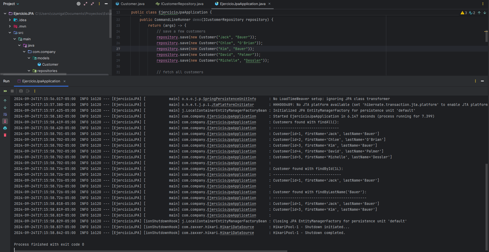

# Ejercicio JPA con Spring Boot



Este proyecto es un ejemplo de cómo usar JPA (Java Persistence API) con Spring Boot. El proyecto incluye un modelo de `Customer`, un repositorio para acceder a los datos de los clientes y una aplicación principal que demuestra cómo interactuar con la base de datos.

## Requisitos

- Java 11 o superior
- Maven 3.6.0 o superior

## Estructura del Proyecto

- `src/main/java/com/company/models/Customer.java`: Clase de entidad `Customer`.
- `src/main/java/com/company/repositories/ICustomerRepository.java`: Repositorio de Spring Data JPA para `Customer`.
- `src/main/java/com/company/EjercicioJpaApplication.java`: Clase principal de la aplicación Spring Boot.

## Cómo Ejecutar

1. Clona el repositorio:
   ```sh
   git clone <URL_DEL_REPOSITORIO>
   cd <NOMBRE_DEL_PROYECTO>